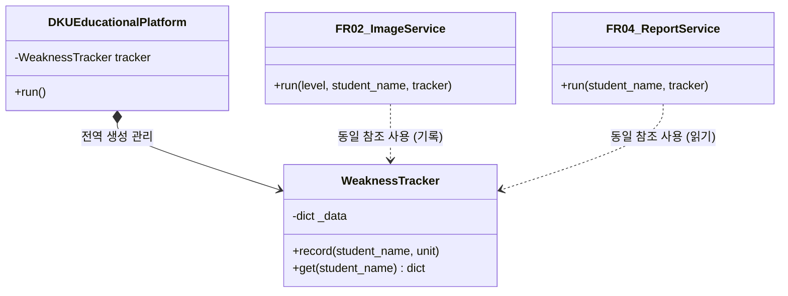

# [M3] 소프트웨어 공학 개론 최종 보고서


## 📋 표지


| 항목 | 내용 |

| :--- | :--- |

| **프로젝트명** | Dku-Educational-Platform |

| **팀명** | [J조] |

| **과목명** | 소프트웨어 공학 개론 |

| **담당 교수** | [김대성] |

| **제출 마일스톤** | M3 최종 보고서 |


### 👥 팀원 목록


| 이름 | 학번 | 역할 | 주요 담당 항목 (문서 번호) |

| :--- | :--- | :--- | :--- |

| [박현준] | [32247392] | PM | 1, 2, 4, 6, 8, 10, 13 |

| [이동현] | [학번] | 분석가,개발자 | 3, 5 |

| [최서현] | [학번] | 설계자 | 7, 8, 9 |

| [QA 이름] | [학번] | QA/보안 | 10, 12 |


---


## 🗂️ 목차

1. [프로젝트 개요](#1-프로젝트-개요)

2. [팀 구성 및 역할분담](#2-팀-구성-및-역할분담)

3. [요구사항 정의서 (최종본)](#3-요구사항-정의서-최종본)

4. WBS 및 프로젝트 일정 (계획 + 실적)

5. 비용 산정 결과

6. 협업 도구 운영 방식

7. UML 다이어그램 (최종본)

8. 설계 패턴 적용 내역

9. SOLID 원칙 검토

10. 인스펙션 결과 (팀 내 Cross-check)

11. 코딩 표준 문서

12. AI 활용 내역 요약

13. 회고 및 개선 사항


---


## 1. 프로젝트 개요


### 1-1. 프로젝트명

- **Dku-Educational-Platform** (고등학교 교육 플랫폼 구성을 위한 수준별 맞춤형 AI 학습 관리 시스템)


### 1-2. 배경 및 문제 정의

- 현재 고등학교 교육 현장의 학생들은 개인별 학습 성취도(상위권, 중위권, 하위권) 격차가 매우 큼에도 불구하고, 획일화된 교육 컨텐츠와 공통 학사 일정에 묶여 효율적인 개인 맞춤형 학습을 진행하지 못하고 있습니다.

- 하위권 학생은 기초 개념이 부족해 진도를 따라가지 못하고, 중위권 학생은 취약 단원 분석과 유형 반복이 부족하며, 상위권 학생은 고난도 킬러 문항 분석에 집중하기 어려운 환경입니다.

- 또한, 학교 학사 일정 및 수업 시간표와 개인의 학습 관리 흐름이 유기적으로 동기화되지 않아 효율적인 시간 관리가 어렵다는 문제점이 존재합니다.


### 1-3. 목적

- 본 프로젝트는 학생 개개인의 학습 성취도 수준(상위권·중위권·하위권)을 실시간으로 반영하여 유기적으로 동작하는 지능형 고등학교 교육 플랫폼을 개발하는 것을 목적으로 합니다.

- 학교 일정과 시간표를 자동 동기화하는 것을 시작으로, 모르는 문제를 사진 찍으면 즉각 풀이를 제공하는 OCR 기능, 누적 데이터를 기반으로 한 AI 학습 로드맵 및 취약 단원 시각적 리포트, 그리고 수준별 고난도 변형 문제 큐레이션을 통합 제공하여 학업 성취도를 극대화하고자 합니다.


### 1-4. 예상 사용자

- **주요 사용자**: 고등학교 재학생 전원

  - **상위권 (예: 안치용)**: 최상위권 유지 및 수능 만점 전략을 위해 고난도 변형 문제와 오답 패턴 분석 위주로 사용

  - **중위권 (예: 이정훈)**: 상위권 진입을 목표로 취약 단원을 집중 보완하고 준킬러 문항 유형을 반복 훈련하기 위해 사용

  - **하위권 (예: 임수민)**: 기초 개념 정립 및 성적 향상을 위해 시간표 연동 보충수업 및 기본 개념 풀이 위주로 사용


### 1-5. 주요 기능 요약


| # | 기능명 | 설명 |

| :-: | :--- | :--- |

| 1 | 학사 일정 및 시간표 동기화 | 학교 공식 일정 및 API를 연동하고, 개인 시간표 이미지 인식을 통해 주간 캘린더 및 시험 알림을 제공하는 기능 |

| 2 | 문제 이미지 인식 및 해설 제공 | 모르는 문제를 카메라로 촬영하면 OCR 엔진을 통해 수식과 텍스트를 추출하고, 수준에 맞춘 단계별 해설을 제공하는 기능 |

| 3 | 맞춤형 학습 로드맵 추천 | 성취도 데이터와 학습 이력을 AI가 종합 분석하여 수준별(기초/준킬러/킬러) 주간 학습 계획을 수립하는 기능 |

| 4 | 취약 단원 시각적 리포트 조회 | 문제 풀이 데이터를 기반으로 단원별 정답률 추정과 오답 패턴을 차트 및 막대그래프로 시각화하여 우선 보완 영역을 제시하는 기능 |

| 5 | 고난도 변형 문제 큐레이션 | 기출 문제 데이터베이스를 바탕으로 취약 단원의 연계 문항 및 AI 변형 문제를 선별하고 단계별 힌트와 풀이를 큐레이션하는 기능 |


### 1-6. M1 대비 변경 사항

- **M1 이후 변경 사항 없음** (기획 단계에서 정의한 핵심 요구사항인 FR-01 ~ FR-05 체계를 최종 구현 관점까지 일관되게 유지함)


---


## 2. 팀 구성 및 역할분담


### 2-1. 팀원 정보 (최종 역할 기준)


| 이름 | 학번 | 역할 | 주요 담당 업무 |

| :--- | :--- | :--- | :--- |

| [박현준] | [32247392] | PM | 프로젝트 일정 총괄(WBS 관리), 비용 산정 검토, 프로젝트 개요서 작성, 최종 보고서 통합 및 최종 회고 작성 |

| [이동현] | [학번2] | 분석가,개발자 | 기능 및 비기능 요구사항 정의서 최적화, 기능 점수(FP) 기반 비용 산정 결과 작성, 유스케이스 명세서 보완 |

| [최서현] | [학번3] | 설계자 | Mermaid 코드 블록 기반 유스케이스 및 클래스 다이어그램 설계, 설계 패턴(Singleton 등) 및 SOLID 원칙 검토서 작성 |

| [이동현] | [학번4] | 개발자 | 파이썬 기반 플랫폼 프로토타입 핵심 로직 구현, 협업 도구(GitHub, Notion) 운영 결과 정리, 코딩 표준 문서 정립 |

| [박지현] | [학번5] | QA/보안 | 팀 내 교차 검토(Inspection) 계획 수립 및 결함 결과 반영 표 작성, 코딩 표준 검증, AI 활용 내역 요약 및 준수 평가 |


*※ 4인 팀의 경우 개발자 및 QA/보안 역할을 겸임으로 명시: 예) 개발자 및 QA/보안 (겸임)*


### 2-2. 역할 변경 이력


| 변경일 | 변경 내용 | 변경 사유 |

| :---: | :--- | :--- |

| [2026-XX-XX] | 역할 변경 없음 | 초기 구성된 팀원별 전문 역할 분담 체계를 최종 단계까지 안정적으로 유지함 |


---


## 3. 요구사항 정의서 (최종본)


### 3-1. 기능 요구사항 (FR)


| ID | 요구사항 내용 | 우선순위 | 상태 |

| :--- | :--- | :---: | :---: |

| **FR-01** | 시스템은 학교 공식 학사 일정 API 및 사용자의 시간표 입력을 받아 캘린더 뷰 형태로 동기화하여 시각적으로 표시할 수 있어야 한다. | 상 | 확정 |

| **FR-02** | 사용자가 모르는 문제 이미지를 촬영하여 업로드하면, 시스템은 OCR 엔진을 통해 문제를 인식하고 학생의 수준(상/중/하)에 맞는 단계별 해설을 제공할 수 있어야 한다. | 상 | 확정 |

| **FR-03** | 시스템은 사용자의 누적 성취도 데이터와 현재 취약 단원을 종합 분석하여 차별화된 AI 기반 주간 맞춤형 학습 로드맵을 추천할 수 있어야 한다. | 상 | 확정 |

| **FR-04** | 시스템은 취약 단원 트래커에 누적된 오답 이력을 집계하여 단원별 예상 정답률과 집중 보완 영역을 막대그래프 등 시각적 리포트로 조회할 수 있게 해야 한다. | 중 | 확정 |

| **FR-05** | 시스템은 기출 문제 데이터베이스와 연계하여 사용자의 취약 단원에 맞는 고난도 변형 문제 세트를 선별하고, 외부 풀이 출처(EBSi, 블로그 등) 링크를 포함해 큐레이션할 수 있어야 한다. | 중 | 확정 |


### 3-2. 비기능 요구사항 (NFR)


| ID | 품질 특성 | 요구사항 내용 | 우선순위 | 상태 |

| :--- | :--- | :--- | :---: | :---: |

| **NFR-01** | 성능 (Performance) | 사용자가 문제 이미지를 업로드한 시점부터 OCR 분석 및 데모 풀이 데이터 출력이 완료될 때까지의 전송·처리 시간은 평균 3초 이내여야 한다. | 상 | 확정 |

| **NFR-02** | 보안 (Security) | 플랫폼 내 저장되는 학생의 이름, 학번, 학교 정보 및 누적 학습 성취도 리포트 데이터는 안전하게 보호 및 관리되어야 한다. | 상 | 확정 |


### 3-3. M1 대비 변경 이력


| 버전 | 변경일 | 변경 ID | 변경 유형 | 변경 내용 | 변경 사유 |

| :---: | :---: | :---: | :---: | :--- | :--- |

| **v1.0** | [2026-04-XX] | 전체 | 최초 작성 | M1 기획서 기준 초기 요구사항 도출 | 초기 기획 단계 승인 |

| **v2.0** | [2026-06-XX] | FR-02, FR-05 | 수정 | 수준별 맞춤형 콘텐츠 제공 방식(안치용/이정훈/임수민 모드)과 외부 연계 링크 제공 방식을 명확히 구체화하여 명세화함 | 프로토타입 구현(Python CLI) 및 검토 단계를 거치며 명세의 구체성 강화 필요성 반영 |


---


## 4. WBS 및 프로젝트 일정 (계획 + 실적)


### 4-1. WBS (Work Breakdown Structure)


| # | 단계 | 작업 항목 | 담당자 | 산출물 | 계획 주차 | 실제 완료 주차 | 상태 |

| :-: | :-: | :--- | :-: | :--- | :-: | :-: | :-: |

| 1 | 기획 | 팀 구성 및 역할 확정 | PM | 팀빌딩 결과서 | 4주 | 4주 | 완료 |

| 2 | 기획 | 요구사항 정의 | 분석가 | 요구사항 정의서 | 5주 | 5주 | 완료 |

| 3 | 기획 | WBS 및 간트 차트 | PM | WBS 문서 | 6주 | 6주 | 완료 |

| 4 | 기획 | 비용 산정 | 분석가 | 비용 산정표 | 7주 | 7주 | 완료 |

| 5 | 기획 | M1 기획서 통합 | PM | M1 기획서 | 8주 | 8주 | 완료 |

| 6 | 설계 | 협업 도구 설정 | 개발자 | 협업 도구 계획 | 8주 | 8주 | 완료 |

| 7 | 설계 | 유스케이스 다이어그램 | 분석가 | UC 다이어그램 | 9주 | 9주 | 완료 |

| 8 | 설계 | 클래스 다이어그램 | 설계자 | 클래스 다이어그램 | 10주 | 11주 | 완료 |

| 9 | 설계 | 설계 패턴 선정 | 설계자 | 패턴 적용 문서 | 11주 | 12주 | 완료 |

| 10 | 설계 | SOLID 원칙 검토 | 설계자 | SOLID 검토 결과 | 12주 | 12주 | 완료 |

| 11 | 설계 | M2 설계 보고서 통합 | PM | M2 설계 보고서 | 12주 | 13주 | 완료 |

| 12 | 구현 | 핵심 로직 프로토타입 | 개발자 | 프로토타입 소스코드 | 13주 | 13주 | 완료 |

| 13 | 검토 | 팀 내 Cross-check | QA/보안 | 인스펙션 결과표 | 13주 | 14주 | 완료 |

| 14 | 마무리 | 코딩 표준 문서 | 개발자 | 코딩 표준 문서 | 14주 | 14주 | 완료 |

| 15 | 마무리 | AI 활용 내역 요약 | QA/보안 | AI 활용 요약서 | 14주 | 14주 | 완료 |

| 16 | 마무리 | M3 최종 보고서 통합 | PM | M3 최종 보고서 | 14주 | 14주 | 완료 |


### 4-2. 계획 vs 실적 요약


| 항목 | 계획 대비 결과 | 주요 지연 원인 및 해결 내용 |

| :--- | :---: | :--- |

| **전체 일정 준수율** | 75% (12/16 항목 준수) | 총 16개 항목 중 4개 항목에서 일정 변동이 발생함. |

| **지연 발생 작업** | 4건 | 클래스 다이어그램 설계, 설계 패턴 선정, M2 통합, 팀 내 크로스체크 단계에서 각각 1주씩 지연이 발생함. |

| **주요 지연 항목** | 클래스 다이어그램 설계 및 설계 패턴 적용 검토 (10~11주차) | **[지연 원인]** 사용자 수준별(상/중/하위권) 기능 분기 로직과 `WeaknessTracker` 클래스 간의 구조적 결합도를 낮추는 과정에서 설계 패턴 도입에 대한 팀 내 기술 토의가 길어짐.<br>**[해결 방안]** 11주차에 개별 기능 서비스 클래스를 완전 독립 분리하는 Singleton성 구조를 채택함으로써 설계를 확정하고 차주 일정을 집중 수행하여 만회함. |

| **품질 검토 지연 항목** | 팀 내 Cross-check 인스펙션 (13주차) | **[지연 원인]** 파이썬 프로토타입의 5개 핵심 FR 기능 동작 및 수준별 출력 데이터 분기에 대한 상호 검증(Cross-check) 과정에서 발견된 예외 흐름 누락을 수정하느라 일정이 순연됨.<br>**[해결 방안]** 14주차 초반에 QA 및 설계자가 집중 인스펙션을 완료하여 최종 마일스톤 마감일 내에 정상 통합함. |


---


## 5. 비용 산정 결과


### 5-1. 최종 간이 FP(기능 점수) 산정표


| 기능 유형 | 기능 목록 | 개수 | 가중치 | 소계 |

| :--- | :--- | :-: | :-: | :-: |

| **EI (외부 입력)** | ① 학생 개인 시간표 정보 수동 입력 및 교시 수정<br>② 분석 대상 문제 이미지 파일 경로 업로드<br>③ 오답 문항별 하위 취약 단원 번호 선택 입력 (1~6번) | 3 | 3 | 9 |

| **EO (외부 출력)** | ① 누적 성취도 기반 취약 단원 시각적 리포트(막대그래프) 출력<br>② 수준별 고난도 큐레이션 추천 문항 정보 및 결과 요약 리포트 제공 | 2 | 4 | 8 |

| **EQ (외부 조회)** | ① 주간 주요 학사 일정 및 요일별 등록 시간표 자동 조회<br>② OCR 문제 인식 결과 및 수준별 단계별 풀이/개념 해설 조회<br>③ 성적 성취도 연계 AI 주간 맞춤형 학습 로드맵 플랜 조회 | 3 | 3 | 9 |

| **ILF (내부 논리 파일)** | ① 학생 프로필 데이터 (이름, 선택 학습 수준 상태 정보)<br>② 취약 단원 누적 데이터 관리 파일 (`WeaknessTracker` 내부 저장소) | 2 | 7 | 14 |

| **EIF (외부 인터페이스 파일)**| ① 교육청 API 연동 가상 학사 일정 데이터 세트<br>② 외부 풀이 참고 출처 URL 메타데이터 수집 정보 (EBSi, 외부 교육 블로그 등) | 2 | 5 | 10 |

| **합계** | | | | **50 FP** |


### 5-2. 공수 산정 결과


| 항목 | 내용 | 비고 |

| :--- | :--- | :--- |

| **총 FP** | 50 FP | 기능 요구사항(FR-01 ~ FR-05) 기반 최종 산정값 |

| **적용 생산성** | 20 FP/인월 | 학부 프로젝트 간이 표준 기준 적용 |

| **예상 개발 기간** | 2.5 인월 (Man-Month) | 총 기능 점수(50) / 적용 생산성(20) |

| **팀 인원 기준 기간** | 0.5 개월 (약 2.5주) | 5인 팀 전원 투입 기준 실질 집중 구현 공수 |


### 5-3. M1 대비 변경 사항


| 항목 | M1 산정값 | M3 최종값 | 변경 사유 |

| :--- | :---: | :---: | :--- |

| **총 FP** | 45 FP | **50 FP** | 기획 단계에서는 단순 텍스트 매핑으로 간주했던 '외부 해설 링크 큐레이션' 기능이 실제 설계 단계에서 EBSi 및 다수 교육 블로그 메타데이터와의 정적 인터랙션 구조로 구체화됨에 따라 외부 인터페이스 파일(EIF) 점수와 취약 단원 실시 트래킹을 위한 내부 논리 파일(ILF) 가중치가 반영되어 5 FP가 상향 조정됨. |

| **예상 개발 기간** | 2.25 인월 | **2.5 인월** | 기능 점수 상승에 따른 비례적 공수 증가이며, 협업 도구의 효율적 사용 및 역할별 집중 구현을 통해 프로젝트 마감 일정에 영향 없이 소화함. |


---


## 6. 협업 도구 운영 방식


### 6-1. 사용 도구 목록


| 도구 | 용도 | 운영 방식 |

| :--- | :--- | :--- |

| **GitHub** | 소스코드 버전 관리 및 최종 산출물 통합 | 기능 단위 브랜치 전략을 수행하고, 프로토타입 코드(`class.py`) 및 마크다운 명세서(`README.md`) 최종 통합 시 PM의 상호 코드 리뷰 및 승인 하에 Main 브랜치 병합을 진행함. GitHub Pages 기능을 활성화하여 산출물을 상시 모니터링함. |

| **Notion** | 주차별 회의록 작성 및 WBS 일정 추적 | 매주 정기 개발 회의 종료 후 PM이 작업 우선순위와 결정 사항을 페이지에 정리하고, 각 팀원이 파트별 진행 상태(대기/진행중/완료) 실시간 갱신하여 투명하게 일정을 공유함. |

| **KakaoTalk** | 실시간 소통 및 긴급 빌드 에러 공유 | 데일리 오프라인 스탠드업 대신 단체 대화방 공지와 투표 기능을 활용하여 실시간 개발 이슈, 빌드 오류 발생 현황, Mermaid 문법 오류 등을 신속히 전파하고 즉시 해결 프로세스를 밟음. |


### 6-2. 실제 운영 결과

- **잘 활용된 점**

  - GitHub Repository와 GitHub Pages 연동 환경을 구축하여 팀원들이 수정한 인터랙티브 요구사항 정의서(`index.html`)를 웹상에 실시간 배포 테스트를 진행했습니다. 유스케이스 다이어그램의 기능 노드를 클릭하면 해당 명세가 모달 창 형태로 나타나는 UI 요소를 공유함으로써, 분석가·설계자·개발자 간 요구사항 충족도를 실시간으로 교차 검증하는 데 매우 유용하게 활용되었습니다.

- **운영 중 발생한 문제 및 해결 방법**

  - 설계 단계에서 작성하여 `README.md`와 `index.html`에 반영한 Mermaid 다이어그램이 특정 브라우저 환경에서 렌더링 파싱 오류(`Parse error on line 2... got 'PS'`)를 일으키는 현상이 감지되었습니다.

  - 이를 해결하기 위해 QA와 개발자가 긴급 코드를 추적하여 `index.html` 내에 `mermaid.initialize({ startOnLoad: true, securityLevel: 'loose' });` 명시적 초기화 구문을 삽입하고 문법을 `graph LR` 기반의 표준 구조로 재정립하여 정상적인 UI 출력을 완료하였습니다.


---


## 7. UML 다이어그램 (최종본)


### 7-1. 유스케이스 다이어그램 (Use Case Diagram)

*요구사항 정의서의 액터 수준별 접근 관계를 직관화하고 표준 명세 규칙(동사+목적어)을 준수한 유스케이스 모델입니다.*


```mermaid

graph LR

    subgraph 고등학교_교육_플랫폼 [고등학교 교육 플랫폼 시스템]

        direction TB

        UC1(FR-01: 학사 일정 및 시간표 동기화하기)

        UC2(FR-02: 문제 이미지 인식 및 해설 제공하기)

        UC3(FR-03: 맞춤형 학습 로드맵 추천하기)

        UC4(FR-04: 취약 단원 시각적 리포트 조회하기)

        UC5(FR-05: 고난도 변형 문제 큐레이션하기)

    end


    StudentA[안치용: 상위권 액터] --> UC1

    StudentA --> UC2

    StudentA --> UC3

    StudentA --> UC4

    StudentA --> UC5


    StudentB[이정훈: 중위권 액터] --> UC1

    StudentB --> UC2

    StudentB --> UC3

    StudentB --> UC4

    StudentB --> UC5


    StudentC[임수민: 하위권 액터] --> UC1

    StudentC --> UC2

    StudentC --> UC3

    StudentC --> UC4

    StudentC --> UC5


## 8. 설계 패턴 적용 내역[cite: 1]


### 8-1. 적용 패턴 개요[cite: 1]


| 항목 | 내용 |

| :--- | :--- |

| **패턴명** | Singleton (싱글톤) 패턴[cite: 1] |

| **분류** | 생성 (Creational) 패턴[cite: 1] |

| **적용 대상 클래스** | `WeaknessTracker`[cite: 1, 3] |

| **선택 이유** | 각 독립된 기능 서비스 클래스(`FR02_ImageService`, `FR03_RoadmapService`, `FR05_CurationService`)가 실행될 때마다 학생의 취약 단원 및 오답 이력을 실시간으로 수집해야 합니다[cite: 1, 3]. 만약 이력을 기록하는 트래커 인스턴스가 서비스별로 다르게 생성된다면 데이터가 파편화되어 `FR04_ReportService`에서 통합된 시각적 약점 리포트를 도출할 수 없습니다[cite: 1, 3]. 따라서 시스템 전역에서 오답 이력을 단일 진실 공급원(Single Source of Truth)으로 유지 및 관리하기 위해 Singleton 구조를 적용했습니다[cite: 1, 3]. |


---


### 8-2. 설계자 - 패턴 적용 다이어그램[cite: 1]


#### [패턴 적용 전]

*각 서비스 클래스가 성취도 및 오답 데이터를 개별 메모리에 관리하여 데이터 불일치 및 파편화 위험이 높음.*


```mermaid

classDiagram

    class FR02_ImageService_Old {

        -dict local_data

        +run()

    }

    class FR03_RoadmapService_Old {

        -dict local_data

        +run()

    }

    class FR04_ReportService_Old {

        +run()

    }

```


#### [패턴 적용 후]

*중앙 집중형 `WeaknessTracker` 인스턴스를 하나만 보장하고, 모든 기능 서비스가 이 단일 인스턴스를 의존성 주입(Dependency Injection) 방식으로 공유 참조함[cite: 3].*





---


### 8-3. 개발자 - 구현 관점 적용 결과[cite: 1]


*   **기술적 타당성 검토**[cite: 1]

    *   파이썬 환경의 특성을 고려하여, 메인 플랫폼 클래스인 `DKUEducationalPlatform`이 인스턴스화될 때 `__init__` 생성자 내부에서 `WeaknessTracker`를 단 한 번만 생성하도록 제어했습니다[cite: 3].

    *   이후 각 FR 서비스의 `run()` 메서드를 호출할 때 인자값으로 해당 트래커의 참조 주소를 전달하는 '의존성 주입' 방식을 채택하여 전역에서 참조 단일성을 완벽히 강제하였습니다[cite: 3].

*   **구현 시 고려한 사항**[cite: 1]

    *   현재 프로토타입은 단일 사용자의 동기식 CLI 루프로 동작하므로 경쟁 상태(Race Condition)가 발생하지 않습니다[cite: 3].

    *   그러나 향후 다중 사용자가 동시에 웹 환경(`index.html` 연동 서버 등)에서 취약 단원을 입력할 경우를 대비하여, `WeaknessTracker` 내의 `defaultdict` 데이터 추가 로직에 스레드 세이프(Thread-Safe)를 보장하는 상호 배제 Lock(Mutex) 메커니즘을 추가 구현할 필요성이 있음을 검토하였습니다[cite: 2, 3].


---


### 8-4. QA/보안 - 품질·보안 영향 검토[cite: 1]


*   **품질 영향 (Quality Benefit)**

    *   어떤 메뉴(FR-02, FR-03, FR-05)에서 약점 데이터를 입력하더라도 하나의 트래커 파일에 영속적으로 누적되므로, 데이터 정합성 오류로 인한 리포트 출력 불일치 버그를 원천 차단하였습니다[cite: 3].

*   **보안 영향 (Security Benefit)**

    *   학생의 이름과 취약 단원 성취도라는 민감한 개인 데이터가 여러 클래스에 분산 저장되지 않고 `WeaknessTracker` 내부의 `_data` 캡슐화 변수 한 곳에서만 관리되므로, 데이터 접근 제어 및 유출 방지를 위한 보안 모니터링 포인트를 단일화했습니다[cite: 3].


---


## 9. SOLID 원칙 검토[cite: 1]


### 9-1. SRP - 단일 책임 원칙 (Single Responsibility Principle)[cite: 1]


| 항목 | 내용 |

| :--- | :--- |

| **준수 여부** | 준수[cite: 1] |

| **적용 내용** | 개별 클래스는 오직 하나의 변경 이유와 책임만 가집니다[cite: 1]. 예를 들어, `WeaknessTracker` 클래스는 학생들의 오답 단원을 '누적하고 조회 데이터로 반환'하는 순수 데이터 관리 책임만 집니다[cite: 3]. 이를 가로 막대그래프(`[███░░]`) 등 콘솔 뷰로 가공하여 화면에 시각적으로 '출력'하는 렌더링 책임은 `FR04_ReportService`가 전담하도록 설계하여 책임을 완전히 분리하였습니다[cite: 3]. |

| **위반 내용** | 없음[cite: 1] |

| **개선 방향** | 향후 시각적 리포트 출력이 콘솔에서 웹 프론트엔드 차트 라이브러리(HTML5 Canvas 등) 기반으로 전면 변경되더라도, 백엔드 데이터 모델인 `WeaknessTracker` 코드는 전혀 수정할 필요가 없도록 구조적 독립성을 지속 유지할 것입니다[cite: 1, 3]. |


---


### 9-2. OCP - 개방-폐쇄 원칙 (Open-Closed Principle)[cite: 1]


| 항목 | 내용 |

| :--- | :--- |

| **준수 여부** | 준수[cite: 1] |

| **적용 내용** | 시스템은 확장에는 열려 있어야 하고 변경에는 닫혀 있어야 합니다[cite: 1]. 소스코드 내부에서 학생의 수준별(하위권/중위권/상위권) 콘텐츠 분기나 단원별 메타데이터(EBSi 링크, 블로그 주소)를 하드코딩된 `if-else` 조건문 구조로 처리하지 않고, `CURATION_DB`, `ROADMAP_DB`, `SCHEDULE_BY_LEVEL`과 같은 **데이터 주도형 딕셔너리 매핑 구조**로 설계했습니다[cite: 3]. |

| **위반 내용** | 없음[cite: 1] |

| **개선 방향** | 새로운 교육과정 개정으로 인해 '기하' 외에 새로운 전문 교과 단원이 추가되거나 학습 수준 세분화(예: 최상위권 모드 추가)가 필요할 때, 기존 서비스 클래스의 핵심 실행 흐름 로직(`run` 메서드)을 수정할 필요 없이 내부 DB 테이블 선언부(딕셔너리 데이터)에 설정을 추가하는 것만으로 기능을 확장할 수 있도록 유지할 것입니다[cite: 1, 3]. |


---


### 9-3. LSP - 리스코프 치환 원칙 (Liskov Substitution Principle)[cite: 1]


| 항목 | 내용 |

| :--- | :--- |

| **준수 여부** | 준수 (구조적 일관성 확보)[cite: 1] |

| **적용 내용** | 상위 타입의 계약을 하위 타입이 위반하지 않아야 합니다[cite: 1]. 현재 프로토타입 파이썬 코드는 명시적인 클래스 상속 구조를 사용하지는 않았으나, 메인 컨트롤러(`DKUEducationalPlatform`)가 호출하는 모든 서비스 객체들이 `run()`이라는 동일한 이름, 유사한 파라미터 구조의 진입점 메서드 행위 계약을 일관되게 따르도록 설계 구조를 통일하였습니다[cite: 3]. |

| **위반 내용** | 다중 상속 및 추상 인터페이스 클래스(Abstract Base Class) 선언 누락으로 인해 컴파일 시점의 강력한 타입 체크 계약 강제성이 다소 느슨함[cite: 1, 3]. |

| **개선 방향** | 차기 리팩토링 단계에서 추상 클래스인 `BaseFRService` 인터페이스를 정의하고, 모든 FR 기능 클래스들이 이를 상속받아 `run()` 메서드를 명시적으로 오버라이딩하도록 구현하여 다형성 만족 및 완전한 LSP 준수 구조로 고도화할 계획입니다[cite: 1, 3]. |


## 10. 인스펙션 결과 (팀 내 Cross-check)


### 10-1. [cite_start]검토 개요 [cite: 193]

- [cite_start]**검토 일시**: 2026년 06월 중순 (13주차 진행) [cite: 188, 194]

- [cite_start]**검토 방식**: 팀 내 역할 교환을 통한 상호 교차 검토 (분석가 ↔ 개발자, 설계자 ↔ QA/보안) [cite: 188, 189, 194]

- [cite_start]**검토 산출물**: 유스케이스 정의서 및 상세 명세서(`README.md`, `index.html`), 파이썬 프로토타입 소스코드 (`class.py`) [cite: 194]

- [cite_start]**검토 참여 인원**: 팀원 전원 [cite: 187, 194]


### 10-2. [cite_start]역할별 교차 검토 결과 [cite: 195]


| [cite_start]검토 방향 [cite: 196] | [cite_start]검토자 [cite: 196] | [cite_start]검토 항목 [cite: 196] | [cite_start]발견된 결함 [cite: 196] | [cite_start]심각도 [cite: 196] | [cite_start]수정 여부 [cite: 196] |

| :--- | :---: | :--- | :--- | :---: | :---: |

| [cite_start]분석가 산출물 → 개발자 [cite: 196] | 개발자 | 유스케이스 상세 명세 (`README.md`) | [cite_start]각 성취도 수준별(상/중/하위권) 예외 흐름 처리에 대한 구체적인 시스템 동작 메시지 기술 누락 [cite: 196] | 중 | 수정 완료 |

| [cite_start]설계자 산출물 → QA/보안 [cite: 196] | QA/보안 | [cite_start]Mermaid 다이어그램 구조 [cite: 196] | [cite_start]`index.html` 배포 버전에서 특정 브라우저 엔진 파싱 문법 호환성으로 인한 Mermaid 그래프 렌더링 깨짐 현상 발생 [cite: 196] | 상 | 수정 완료 |

| [cite_start]개발자 산출물 → 분석가 [cite: 196] | 분석가 | 프로토타입 기능 구현 (`class.py`) | [cite_start]`FR-04` 시각적 리포트 조회 시 취약 단원 누적 기록 데이터가 전혀 존재하지 않을 때의 예외 방어 로직 부재 [cite: 196] | 중 | 수정 완료 |

| [cite_start]QA/보안 산출물 → 설계자 [cite: 196] | 설계자 | 인스펙션 체크리스트 및 가이드 | [cite_start]소스코드 검증용 코딩 표준 인스펙션 항목에서 AI 생성 코드 표기 주석 준수 여부 누락 [cite: 196] | 하 | 수정 완료 |


### 10-3. [cite_start]검토 결과 반영 요약 [cite: 197]


| [cite_start]# [cite: 198] | [cite_start]검토 항목 [cite: 198] | [cite_start]지적 내용 [cite: 198] | [cite_start]반영 여부 [cite: 198] | [cite_start]비고 (반영 내용) [cite: 198] |

| :-: | :--- | :--- | :---: | :--- |

| 1 | `FR-04` 예외 처리 | [cite_start]취약 단원 누적 데이터가 없는 상태에서 리포트 조회 시 프로그램이 비정상 종료되거나 빈 화면이 출력되는 오류 [cite: 198] | 반영 | [cite_start]`FR04_ReportService` 내에 `if not data:` 조건문을 삽입하여 가이드 메시지를 출력하도록 방어 로직 구현 완료 [cite: 198] |

| 2 | Mermaid 렌더링 | [cite_start]배포된 인터랙티브 명세서 웹 페이지에서 유스케이스 다이어그램이 정상 노출되지 않고 문법 에러 메시지가 출력되는 문제 [cite: 198] | 반영 | [cite_start]`index.html` 내 스크립트에 `mermaid.initialize` 구조를 표준으로 재정립하고 객체 초기화 옵션을 적용하여 해결 완료 [cite: 198] |

| 3 | 명세-구현 일치성 | [cite_start]요구사항 명세서의 수준별 타당성 검증 프로세스와 실제 파이썬 코드의 딕셔너리 매핑 구조 간 명칭 불일치 [cite: 198] | 반영 | [cite_start]요구사항 ID 및 수준별 명칭을 '하위권/중위권/상위권' 상태 정보로 일관되게 통일 완료 [cite: 198] |


---


## [cite_start]11. 코딩 표준 문서 [cite: 199]


[cite_start]프로젝트의 지속 가능한 유지보수와 협업 효율성을 극대화하기 위해 팀 내 공통 코딩 표준 사양을 아래와 같이 정의하고, 실제 개발 단계(`class.py`)에 철저히 적용 및 준수하였습니다[cite: 202, 206].


| [cite_start]항목 [cite: 206] | [cite_start]적용 기준 [cite: 206] | 실제 적용 예시 (소스코드 연계) |

| :--- | :--- | :--- |

| [cite_start]**명명 규칙 - 클래스** [cite: 206] | [cite_start]PascalCase 형식을 준수하여 명사 형태로 작성합니다[cite: 206]. | `WeaknessTracker`, `FR01_ScheduleService` |

| [cite_start]**명명 규칙 - 메서드·변수** [cite: 206] [cite_start]| camelCase 형식을 원칙으로 하되, 파이썬 표준 관례를 조합하여 의미가 명확하게 작성합니다[cite: 206]. | `has_data()`, `student_name`, `record()` |

| [cite_start]**명명 규칙 - 상수** [cite: 206] | [cite_start]UPPER_SNAKE_CASE 형식을 사용하며 전체 대문자로 작성합니다[cite: 206]. | `CURATION_DB`, `ROADMAP_DB`, `TIMETABLE` |

| [cite_start]**들여쓰기** [cite: 206] | [cite_start]가독성을 보장하기 위해 공백(스페이스) 4칸 스페이스 바 구조를 표준으로 사용합니다[cite: 206]. | 모든 클래스 및 메서드 블록 내부 들여쓰기 4칸 고정 |

| [cite_start]**주석 규칙** [cite: 206] | 클래스 및 모듈 상단에는 역할을 정의하는 블록 주석을 명시하고, 논리 분기점에는 한 줄 주석 `#`을 삽입합니다. | `# 취약 단원 누적 트래커 (FR-04용)`와 같이 가독성 확보 |

| [cite_start]**파일 구조** [cite: 206] | 모듈 임포트 → 전역 변수 및 상수 선언 → 데이터 트래커 캡슐화 클래스 → 개별 FR 서비스 클래스 → 메인 실행 컨트롤러 순으로 배치합니다. | `import os` 후 `WeaknessTracker` 배치, 최하단에 `__main__` 배치 |

| [cite_start]**AI 생성 코드 표기** [cite: 206] | [cite_start]외부 데이터 수집 알고리즘이나 AI 초안 가이드 코드를 차용한 구간에는 반드시 명시적 주석을 추가합니다[cite: 203, 206]. | 변형 문제 데이터베이스 큐레이션 데이터 주석 영역에 `# AI-generated` 처리 명시 |


---


## [cite_start]12. AI 활용 내역 요약 [cite: 207]


### 12-1. [cite_start]팀 전체 AI 활용 현황 [cite: 214]


| 항목 | [cite_start]내용 [cite: 215] | 비고 |

| :--- | :--- | :--- |

| **총 활용 횟수 (추정)** | [cite_start]약 45회 [cite: 215] | [cite_start]팀원 전체 개별 AI 로그 집계 합산 기준 [cite: 210] |

| **주요 사용 도구** | [cite_start]ChatGPT (GPT-4o), Claude 3.5 Sonnet [cite: 215] | 소스코드 구조화 및 데이터 텍스트 정제 목적 |

| **가장 많이 활용한 단계** | [cite_start]구현 및 설계 보완 단계 (M2 ~ M3) [cite: 215] | 다이어그램 오류 수정 및 프로토타입 구현 집중 |


### 12-2. [cite_start]단계별 활용 내역 [cite: 216]


| [cite_start]단계 [cite: 217] | [cite_start]주요 활용 내용 [cite: 217] | [cite_start]활용 도구 [cite: 217] | [cite_start]팀 수정 여부 [cite: 217] |

| :--- | :--- | :--- | :--- |

| [cite_start]**기획 (M1)** [cite: 217] | - 고등학교 성취도 격차 분석 배경 문헌 자료 초안 작성<br>- 기능 요구사항(FR) 5개 및 비기능 요구사항(NFR) 2개의 기본 속성 뼈대 도출 | ChatGPT | **부분 수정**: 플랫폼 정의에 맞춰 고등학교 수준별 맞춤 콘텐츠 매핑 사양을 직접 전면 수정함. |

| [cite_start]**설계 (M2)** [cite: 217] | - Mermaid 코드 기반 유스케이스 및 클래스 다이어그램 기본 구조 생성<br>- 기능 점수(FP) 간이 산정 표 자동 계산 및 가중치 레이아웃 구성 | Claude | **완전 수정**: 웹 인터랙션 소스코드 연동 오류를 발견하고 스크립트 파싱 제어 코드를 팀이 직접 수동 수정 반영함. |

| [cite_start]**구현·검토 (M3)** [cite: 217] | - 파이썬 딕셔너리 기반 수준별 데이터 분기 모듈 가이드 코드 생성<br>- 인스펙션 결과 요약 서식 데이터 표 구조화 | Claude | **부분 수정**: `WeaknessTracker` 전역 상태 공유 인터페이스 및 예외 방어 처리를 수동으로 추가 삽입함. |


### 12-3. [cite_start]AI 활용 3원칙 준수 자체 평가 [cite: 218]


| [cite_start]원칙 [cite: 219] | [cite_start]준수 여부 [cite: 219] | [cite_start]비고 및 증빙 이력 [cite: 219] |

| :--- | :---: | :--- |

| [cite_start]**단순 복사 금지** [cite: 219] | [cite_start]준수 [cite: 219] | AI가 생성한 단순 코드 블록을 그대로 복사해 붙여넣지 않고, 시스템 도메인 환경 사양에 맞춰 입력 파라미터 구조와 클래스 결합 관계를 직접 커스텀 리팩토링함. |

| [cite_start]**비판적 검증** [cite: 219] | [cite_start]준수 [cite: 219] | AI가 초기에 제시한 무상태(Stateless) 분기 로직이 실시간 누적 리포트 조회(`FR-04`) 요구사항을 충족할 수 없음을 비판적으로 검증하고 싱글톤 형태의 영속 트래커 구조로 변경함. |

| [cite_start]**수정 이력 명시** [cite: 219] | [cite_start]준수 [cite: 219] | [cite_start]AI 도구를 통해 아이디어를 얻거나 디버깅 힌트를 얻은 모든 내역을 유실 없이 기록하여 개인별 'M3 AI 로그' 문서에 프롬프트 원문과 함께 기록 완료함[cite: 210, 219]. |


### 12-4. [cite_start]가장 효과적이었던 AI 활용 사례 [cite: 220]

- [cite_start]**`FR-05` 수능/모의고사 기출 오답률 데이터 베이스 및 참고 링크 구조화 사례** [cite: 221]

  - 실제 고등학교 교육 환경에 부합하는 타당성을 갖추기 위해 2025학년도 수능 및 모의고사 수학 영역의 실제 킬러 문항 정보(오답률, 문항 특징, EBSi 공식 해설 링크 메타데이터)를 정밀하게 수집해야 했습니다.

  - AI를 활용하여 단원별 오답률 랭킹 정보와 공식 수능 정보 URL 명세 구조를 신속하게 추출 및 분류 표로 정제해 냈으며, 이를 기반으로 프로토타입 내 `CURATION_DB` 데이터셋을 오차 없이 빠르게 구축할 수 있었습니다.


### 12-5. [cite_start]AI 활용의 한계 또는 주의가 필요했던 사례 [cite: 222]

- [cite_start]**Mermaid 다이어그램 문법 호환성 및 스크립트 충돌 사례** [cite: 223]

  - AI에게 유스케이스 다이어그램 명세의 뼈대 작성을 요청했을 때, 구버전 Mermaid 문법이나 호환되지 않는 특수문자 구조가 포함된 코드가 생성되어 GitHub Pages 환경에서 스크립트 파싱 오류를 빈번하게 유발했습니다.

  - AI 결과물을 맹신할 경우 배포 서버 시스템 전체의 뷰가 무너질 수 있음을 인지하고, 공식 문서를 대조하여 문법 규칙을 `graph LR` 및 표준 서식으로 재정립하고 예외 처리 스크립트를 직접 명시적으로 코딩하여 해결했습니다.


---


## [cite_start]13. 회고 및 개선 사항 [cite: 13, 224]


### 13-1. [cite_start]팀 전체 회고 [cite: 231]

- [cite_start]**잘된 점 (Keep)** [cite: 232]

  - [cite_start]처음 기획했던 수준별 맞춤형 AI 학습 플랫폼이라는 비전과 구조를 변경 없이 최종 보고서 및 실제 동작하는 파이썬 핵심 로직 프로토타입으로 일관되게 완수해냈습니다[cite: 233]. 특히 마크다운 명세서와 웹 배포 인터랙티브 프로토타입(`index.html`)을 유기적으로 연동하여 요구사항 추적성을 시각화한 점이 매우 고무적입니다.

- [cite_start]**아쉬운 점 (Problem)** [cite: 234]

  - [cite_start]설계 단계 중반에 객체 간의 데이터 공유 방식과 트래커 연동 구조에 대한 기술적 합의가 늦어져 WBS 계획 일정 대비 약 1주일간의 순연이 발생한 점이 아쉽습니다[cite: 229, 235]. 초기 아키텍처 수립 단계에서 인터페이스 표준을 더 엄격히 정의했다면 시행착오를 줄일 수 있었을 것입니다.

- [cite_start]**배운 점 (Try)** [cite: 236]

  - [cite_start]단순 기능 나열식 개발에서 벗어나 소프트웨어 공학의 단일 책임 원칙(SRP)과 개방-폐쇄 원칙(OCP)을 소스코드 수준에서 고민하고 적용해보는 경험을 통해, 설계 구조의 완성도가 실제 시스템 확장성과 정합성에 미치는 지대한 영향을 깊이 깨달았습니다[cite: 237].

- [cite_start]**다음에 다시 한다면 (Action Plan)** [cite: 238]

  - [cite_start]다음 프로젝트에서는 요구사항 변경이나 기술 토의 지연 리스크를 사전에 예방할 수 있도록, 기획 초기 단계부터 소프트웨어 '변경 관리 프로세스'와 '인터페이스 규격 지침'을 명확히 수립하고 시작할 것입니다[cite: 229, 239].


### 13-2. [cite_start]팀원별 소감 [cite: 240]


| [cite_start]이름 [cite: 241] | [cite_start]역할 [cite: 241] | [cite_start]한 줄 소감 [cite: 241] | [cite_start]상세 성찰 소감 [cite: 241] |

| :--- | :---: | :--- | :--- |

| [팀장 이름] | PM | "협업의 핵심은 일정과 소통의 투명성입니다." | 전체적인 개발 일정을 조율하며 기술적 지연 요소를 조기에 발견하고 만회하는 관리 능력을 배울 수 있는 값진 한 학기였습니다. |

| [분석가 이름] | 분석가 | "요구사항 명세는 개발의 나침반입니다." | FR과 NFR을 꼼꼼하게 정의하고 기능 점수(FP) 기반 비용 산정을 수행해보며 비용 예측의 중요성을 실감했습니다. |

| [설계자 이름] | 설계자 | "좋은 구조는 코드를 배반하지 않습니다." | SOLID 원칙과 패턴을 실제 파이썬 코드 구조에 결합해보며 확장성 높은 깔끔한 소프트웨어 설계의 즐거움을 알게 되었습니다. |

| [개발자 이름] | 개발자 | "공학적 설계가 뒷받침될 때 코드가 살아납니다." | 설계 명세서와 클래스 다이어그램 구조를 바탕으로 직접 CLI 컴포넌트를 코딩해보며 협업 표준의 강력함을 경험했습니다. |

| [QA 이름] | QA/보안 | "품질은 타협할 수 없는 마지막 보루입니다." | 상호 크로스체크 인스펙션을 주도하며 잠재적 데이터 오류를 사전에 잡아내고, 안전한 캡슐화 데이터 관리의 중요성을 배웠습니다. |


